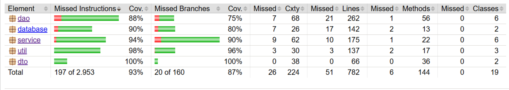

# GoverLens

Η GoverLens είναι μια εφαρμογή η οποία δίνει την ευκαιρία στον απλό πολίτη να αναλάβει καθήκοντα πρωθυπουργού, μέσω της επιθεώρησης και της επεξεργασίας του κρατικού προυπολογισμού των τελευταίων 6 ετών.
Ο χρήστης έχει τη δυνατότητα να πλοηγηθεί στο διαδραστικό μενού πρόσβασης της GoverLens και να επιλέξει ανάμεσα σε πληθώρα επιλογών: προβολή προυπολογισμού, επεξεργασία, σύγκριση μεταξύ ετών, προβολή διαγραμμάτων των στοιχείων του προυπολογισμού, επιβολή μαζικών αλλαγών, αποθήκευση οικονομικών καταστάσεων. Μέσα από αυτή τη διαδικασία, έρχεται σε επαφή με θεμελιωδεις οικονομικές έννοιες, αλλά και κατανοεί σε βάθος τον τρόπο διαχείρησης των εσόδων και των εξόδων της χώρας, καθώς και τον τρόπο χρηματοδότησης των διάφορων οικονομικών φορέων. 
Άραγε, πόσο εύκολη είναι η διαχείριση μιας τέτοιας θέσης;

## Οδηγίες Χρήσης

1. **Εκκίνηση**: Κατά την εκκίνηση, ο χρήστης μπορεί να επιλέξει είτε τη δημιουργία μιας νέας προσομοίωσης, είτε τη συνέχιση μιας ήδη υπάρχουσας, αξιοποιώντας τα αποθηκευμένα δεδομένα από προηγούμενη χρήση.

2. **Επιλογή Έτους**: Ο χρήστης επιλέγει το έτος προϋπολογισμού που επιθυμεί να αναλύσει ή να επεξεργαστεί, μέσα από το διαθέσιμο εύρος 2021–2026.

3. **Λειτουργίες**:

   - **Προβολή**: Η λειτουργία προβολής επιτρέπει την αναλυτική απεικόνιση του Ελληνικού Κρατικού Προϋπολογισμού για το επιλεγμένο έτος. Ο χρήστης μπορεί να εξετάσει ξεχωριστά τα έσοδα, τα γενικά έξοδα, καθώς και τα έξοδα ανά φορέα.

   - **Εξαγωγή** **PDF**:Η εφαρμογή παρέχει τη δυνατότητα εξαγωγής των οικονομικών καταστάσεων της επιλογής του χρήστη σε μορφή PDF, αποθηκεύοντάς τες απευθείας στον υπολογιστή του. Με αυτόν τον τρόπο διευκολύνεται η αρχειοθέτηση, η εκτύπωση και η περαιτέρω αξιοποίηση των αναφορών.

   - **Διαγράμματα**: Η ενότητα των διαγραμμάτων παρουσιάζει τα δεδομένα του προϋπολογισμού μέσω οριζόντιων ραβδογραμμάτων, συνοδευόμενων από τα αντίστοιχα χρηματικά ποσά. Η οπτική αυτή αναπαράσταση διευκολύνει τη σύγκριση των κατηγοριών και βασίζεται πάντοτε στην τρέχουσα κατάσταση της βάσης δεδομένων.

   - **Επεξεργασία**: Η λειτουργία επεξεργασίας παρέχει τρεις ειδικά διαμορφωμένους πίνακες για έσοδα, γενικά έξοδα και έξοδα ανά φορέα, μέσω των οποίων ο χρήστης έχει τη δυνατότητα να τροποποιήσει τον προϋπολογισμό. Υποστηρίζεται: προσθήκη δεδομένων, διαγραφή δεδομένων, ενημέρωση υπαρχουσών εγγραφών.
     
   - **Εξαγωγή** **PDF**:Η εφαρμογή παρέχει τη δυνατότητα εξαγωγής των οικονομικών καταστάσεων της επιλογής του χρήστη σε μορφή PDF, αποθηκεύοντάς τες απευθείας στον υπολογιστή του. Με αυτόν τον τρόπο διευκολύνεται η αρχειοθέτηση, η εκτύπωση και η περαιτέρω αξιοποίηση των αναφορών.

   - **Σύγκριση**: Σύγκριση των οικονομικών αναλύσεων μεταξύ δύο ετών της επιλογής του χρήστη. Η ανάλυση πραγματοποιείται βάσει της τρέχουσας μορφής της βάσης, γεγονός που σημαίνει ότι οποιαδήποτε προηγούμενη επεξεργασία από τον χρήστη επηρεάζει άμεσα το τελικό αποτέλεσμα.

   - **Μαζικές** **αλλαγές**: Μέσω της λειτουργίας μαζικών αλλαγών, ο χρήστης μπορεί να εφαρμόσει ποσοστιαίες μεταβολές σε ολόκληρες κατηγορίες του προϋπολογισμού με ένα μόνο κλικ. Η δυνατότητα αυτή συμβάλλει στην εξοικονόμηση χρόνου και διευκολύνει τη γρήγορη ανάπτυξη και αξιολόγηση εναλλακτικών οικονομικών στρατηγικών.

Ευελιξία και Συνέχεια Χρήσης:

 - Ο χρήστης δεν περιορίζεται στην επιλογή ενός μόνο έτους, αλλά μπορεί να μεταβαίνει ελεύθερα μεταξύ όλων των διαθέσιμων ετών. Όλες οι αλλαγές αποθηκεύονται αυτόματα, επιτρέποντας τη συνέχιση της εργασίας από το σημείο που διακόπηκε, χωρίς απώλεια δεδομένων.


## Τεχνολογικό Οικοσύστημα

Η υλοποίηση της εργασίας βασίστηκε στη χρήση ενός ολοκληρωμένου τεχνολογικού οικοσυστήματος για την ανάπτυξη του έργου **GoverLens**.

- **Git / GitHub**
  - Διαχείριση εκδόσεων του κώδικα
  - Συνεργασία και συγχρονισμός μεταξύ των μελών της ομάδας

- **Eclipse** & **Visual Studio**
  - Ανάπτυξη και εκτέλεση του απαιτούμενου κώδικα

- **Maven**
  - Διαχείριση του κύκλου ζωής του έργου
  - Αυτοματοποίηση build και dependencies

- **CLOC**
  - Καταμέτρηση γραμμών κώδικα
  - Ποσοτική αποτίμηση της ανάπτυξης

- **SpotBugs**, **Checkstyle**, **JaCoCo**, **JUnit**
  - Έλεγχος ποιότητας κώδικα
  - Εντοπισμός πιθανών σφαλμάτων
  - Διασφάλιση αξιοπιστίας και σωστής λειτουργίας των κλάσεων

- **PlantUML** & **Canva**
  - Δημιουργία διαγραμμάτων
  - Οπτικοποίηση σχέσεων μεταξύ των κλάσεων
  - Υποστήριξη παρουσιάσεων

- **SQLite** & **Microsoft Excel**
  - Αποθήκευση δεδομένων
  - Οργάνωση και επεξεργασία πληροφοριών σχετικών με κρατικούς προϋπολογισμούς

- **ChatGPT**, **Gemini**, **Claude**
  - Υποστήριξη μέσω εργαλείων τεχνητής νοημοσύνης
  - Καθοδήγηση στην επίλυση τεχνικών προβλημάτων

- **Microsoft Teams**
  - Επικοινωνία και ανατροφοδότηση μεταξύ των μελών της ομάδας

 

## **Download**

- Εδώ πορείτε να κατεβάσετε την τελευταία έκδοση της GoverLens για Windows:  
[⬇️ GoverLens.exe](https://github.com/FilothodorosChristos/404_NOT_FOUND/releases/download/v1.0.0/GoverLens.exe)


- *Εναλλακτικά: Οδηγίες εκτέλεσης του προγράμματος από Windows Command-Line*

 **Προαπαιτούμενα**

- **Λειτουργικό Σύστημα:** Windows  
- **Java:** JDK 17 ή νεότερη  
- **Maven:** 3.8 ή νεότερο  


# Εκτέλεση εφαρμογής από Windows Command-Line

1. Κλωνοποίηση του repo:
   ```bash
   git clone https://github.com/FilothodorosChristos/404_NOT_FOUND.git
   cd 404_NOT_FOUND

2. Build με maven
   ```bash
   mvn clean package

  Μετά την ολοκλήρωση, το εκτελέσιμο JAR θα είναι:
   ```bash
   target/GoverLens-0.0.1-SNAPSHOT.jar
   ```
3. Εκτέλεση της εφαρμογής
   ```bash
   java -jar target/GoverLens-0.0.1-SNAPSHOT.jar


## Δομή Αποθετηρίου
  
```text
404_NOT_FOUND/
│
├── src/
│   ├── main/
│   │   ├── java/
│   │   │   ├── gui/
│   │   │   │   ├── ActionSelectionPanel.java
│   │   │   │   ├── BudgetViewPanel.java
│   │   │   │   ├── ChartRenderer.java
│   │   │   │   ├── ComparisonPanel.java
│   │   │   │   ├── ComparisonService.java
│   │   │   │   ├── DataEditorPanel.java
│   │   │   │   ├── FinanceChartPanel.java
│   │   │   │   ├── GraphDataImporter.java
│   │   │   │   ├── LogViewerPanel.java
│   │   │   │   ├── MainFrame.java
│   │   │   │   ├── MassiveChangesPanel.java
│   │   │   │   ├── ProjectSelectionPanel.java
│   │   │   │   ├── WelcomePanel.java
│   │   │   │   └── YearSelectionPanel.java
│   │   │   │
│   │   │   ├── dao/
│   │   │   │   ├── CashFlow.java
│   │   │   │   ├── CashFlowDao.java
│   │   │   │   ├── Foreis.java
│   │   │   │   ├── ForeisDao.java
│   │   │   │   ├── Log.java
│   │   │   │   └── LogDao.java
│   │   │   │
│   │   │   ├── database/
│   │   │   │   ├── DataImporter.java
│   │   │   │   └── DatabaseSetup.java
│   │   │   │
│   │   │   ├── dto/
│   │   │   │   ├── CashFlowCompareDto.java
│   │   │   │   └── ForeasCompareDto.java
│   │   │   │
│   │   │   ├── service/
│   │   │   │   ├── CashFlowService.java
│   │   │   │   ├── ForeisService.java
│   │   │   │   ├── LogService.java
│   │   │   │   ├── ScenarioCashflowService.java
│   │   │   │   ├── ScenarioForeisService.java
│   │   │   │   └── SimulationService.java
│   │   │   │
│   │   │   └── util/
│   │   │       ├── DbExistsChecker.java
│   │   │       ├── PdfExporter.java
│   │   │       └── ValidationUtils.java
│   │   │
│   │   └── resources/
│   │       ├── data/
│   │       │   ├── B21Esoda.csv - B26Esoda.csv
│   │       │   ├── B21Exoda.csv - B26Exoda.csv
│   │       │   └── B21Foreis.csv - B26Foreis.csv
│   │       │
│   │       ├── db/
│   │       │   └── originalDB.db
│   │       │
│   │       ├── BackgroundPhoto.jpg
│   │       └── GoverLensLogo.jpg
│   │
│   └── test/
│       └── java/
│           ├── dao/
│           │   ├── CashFlowDaoTest.java
│           │   ├── CashFlowTest.java
│           │   ├── ForeisDaoTest.java
│           │   ├── ForeisTest.java
│           │   └── LogDaoTest.java
│           │
│           ├── database/
│           │   ├── DataImporterTest.java
│           │   └── DatabaseSetupTest.java
│           │
│           ├── dto/
│           │   ├── CashFlowCompareDto.java
│           │   └── ForeasCompareDto.java
│           │
│           ├── service/
│           │   ├── CashFlowServiceTest.java
│           │   ├── ForeisServiceTest.java
│           │   ├── LogServiceTest.java
│           │   ├── ScenarioCashflowServiceTest.java
│           │   ├── ScenarioForeisServiceTest.java
│           │   └── SimulationServiceTest.java
│           │
│           ├── util/
│           │   ├── DbExistsCheckerTest.java
│           │   ├── PdfExporterTest.java
│           │   └── ValidationUtilsTest.java
│           │
│           └── resources/data/
│               ├── B23EsodaTEST.csv
│               ├── B23ExodaTEST.csv
│               └── B23ForeisTEST.csv
│
├── docs/
│   └── images/
│       ├── Screenshot 2026-01-05 122437.png
│       └── project_diagram.png
│
├── .gitignore
├── checkstyle.xml
├── LICENSE
├── pom.xml
└── README.md
```

## UML Class Diagram



## Αλγόριθμοι & Δομές Δεδομένων

### Δομές Δεδομένων
- **ArrayList/List**: Διαχείριση συλλογών δεδομένων (φορείς, έσοδα, έξοδα)
- **DefaultTableModel**: Παρουσίαση δεδομένων σε πίνακες UI
- **SQL Tables (B-tree indexes)**: Persistent storage με βελτιστοποιημένες αναζητήσεις

### Αλγόριθμοι
- **Linear Search (Stream API)**: Φιλτράρισμα και επεξεργασία δεδομένων, O(n)
- **SQL Indexed Search**: Αναζήτηση με B-tree, O(log n)
- **Map-Reduce (Streams)**: Υπολογισμός αθροισμάτων και aggregations
- **Comparison Algorithm**: Υπολογισμός διαφορών και ποσοστιαίων μεταβολών
- **Validation Checks**: Έλεγχος ορίων και constraints, O(1)

### Patterns & Techniques
- **SQL Triggers**: Αυτόματη καταγραφή αλλαγών (logging)
- **SwingWorker**: Asynchronous processing για responsive UI
- **DAO Pattern**: Διαχωρισμός data access από business logic

## Πρόσθετη Τεχνική Τεκμηρίωση

### JavaDoc Documentation
https://filothodoroschristos.github.io/404_NOT_FOUND/javadoc/

- **Πλήρης τεκμηρίωση classes**: Όλες οι κλάσεις περιέχουν JavaDoc comments με περιγραφή σκοπού
- **Τεκμηρίωση μεθόδων**: Κάθε public/protected μέθοδος περιλαμβάνει:
- Περιγραφές, @param, @return, @throws tags(Έτσι,γίνεται πιο εύκολη η ανάγνωση τη λειτουργίας των κλάσεων για κατανόηση αλλά και διόρθωση σφαλμάτων)


## Έλεγχος ποιότητας κώδικα (JACOCO)


### Πρόσθετες  μετρήσεις

```text

Total : 55 files,  7954 codes, 1684 comments, 1917 blanks, all 11555 lines

Languages
+----------+------------+------------+------------+------------+------------+
| language | files      | code       | comment    | blank      | total      |
+----------+------------+------------+------------+------------+------------+
| Java     |         51 |      7,125 |      1,633 |      1,816 |     10,574 |
| XML      |          2 |        604 |         44 |         36 |        684 |
| Markdown |          1 |        195 |          0 |         54 |        249 |
| YAML     |          1 |         30 |          7 |         11 |         48 |
+----------+------------+------------+------------+------------+------------+

```
## Αναφορά για τη χρήση Τεχνητής Νοημοσύνης (ChatGPT)

- **AI Report**: [PDF](https://github.com/user-attachments/files/24563073/AI.Report.pdf)


